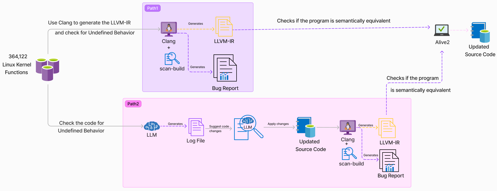

# Static Analyzer Enhanced with LLMs for Undefined Behavior Sanitization

## Overview

This project provides a static analysis process that detects and addresses undefined behavior (UB) in programs. The tool utilizes Large Language Models (LLMs) to enhance traditional static analysis, offering suggestions and validating fixes using LLVM tools.

## Process Flow

The process consists of the following steps:

1. **Static Analysis Tool**: Use a static analysis tool to check for undefined behavior (UB) in the original program.
2. **LLM Static Analysis**: Apply an LLM model to reason about the code and act as an additional static analyzer to discover undefined behavior.
3. **Comparison of Results**: Compare the results from both the static analysis tool and the LLM. Create a comparison table to track whether both methods identified the same UB, and document any discrepancies.
4. **Generate LLVM-IR**: Use Clang to generate the LLVM Intermediate Representation (LLVM-IR) from the original program.
5. **LLM Suggestion and Application**: Ask the LLM to suggest a solution for the identified UB. Apply the suggested solution to a copy of the program and generate a new LLVM-IR using Clang.
6. **Verification with Alive2**: Use Alive2 to check both LLVM-IR versions are semantically equal. If Alive2 finds the change acceptable, suggest the modified code to the user; otherwise, reject the change.

## Flowchart



## Benchmark Description

The benchmark utilized in this project consists of a comprehensive set of 364,122 compilable Linux kernel functions. This benchmark was meticulously curated, drawing inspiration from the [AnghaBench project](https://lac-dcc.github.io/pubs/TechReports/LaC_TechReport012020.pdf). Leveraging the artifacts from the associated paper, a function extractor and type inference engine were employed to generate compilable single-function files. These files maintain the original directory structure of the Linux kernel repository, ensuring a close resemblance to the source.

The Linux kernel was chosen for this benchmark due to its complexity and the profound impact that addressing undefined behavior (UB) can have. In C and C++ programming, undefined behavior arises when the language standards do not specify the outcome, leading to unpredictable and often problematic results. UB is a critical concern as it frequently underlies numerous bugs and vulnerabilities in software systems.

Potential consequences of undefined behavior include:

> - **Compiler Variability**: Programs may exhibit different behaviors when compiled with various compilers, compiler versions, or optimization settings.
> - **Security Vulnerabilities**: UB can create vulnerabilities, exposing software to potential exploits.
> - **Unexpected Termination**: Programs may terminate abruptly or enter infinite loops.
> - **Incorrect Outputs**: Programs may generate incorrect or nonsensical results.

By concentrating on the Linux kernel, this exploration seeks to identify, propose fixes for, and mitigate undefined behavior, ultimately enhancing the reliability and security of C and C++ software systems.

### Compile Script

The `compile.sh` script is provided to compile the benchmark and generate the artifacts described in the flowchart as Path1.

To use the script, run:

```bash
./compile.sh [source_dir]
````
## Required Dependencies for Running LLM-UBSanitizer

- **[GenAI Script](https://microsoft.github.io/genaiscript/getting-started/installation/)**
- **[LLVM](https://llvm.org/docs/GettingStarted.html#quick-start)**
- **[Clang](https://clang.llvm.org/get_started.html)**
- **[Frama-C with Eva plugin](https://frama-c.com/html/get-frama-c.html)**
- **[Alive2](https://github.com/AliveToolkit/alive2#building-alive2)**
- **[Ollama](https://ollama.com/)**

## Installation

To get started with the project, clone this repository and follow the instructions below.

```bash
bash analysis.sh  [source_code_with_path]
```
