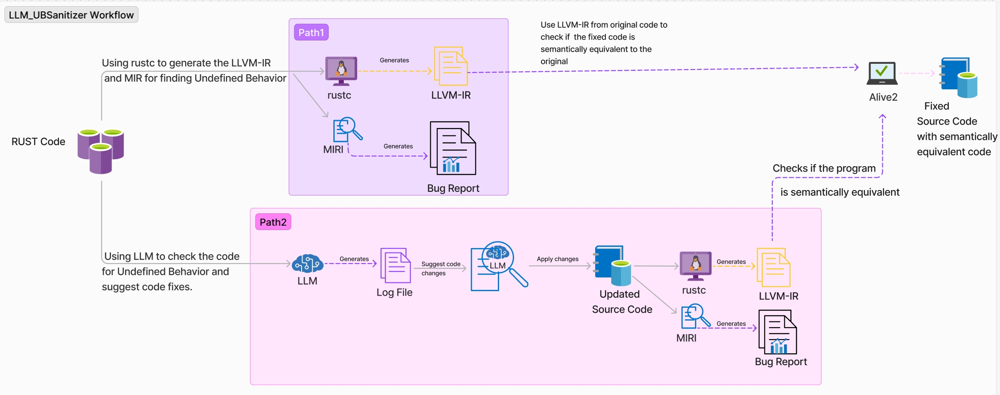

# Static Analyzer Enhanced with LLMs for Undefined Behavior Sanitization

## Overview

This project provides a static analysis pipeline that detects and addresses undefined behavior (UB) in Rust programs. The tool utilizes Large Language Models (LLMs) to augment traditional static analysis, offering suggestions and validating fixes using tools like MIRI for undefined behavior detection.

## Process Flow

The analysis process consists of the following steps:

1. **Static Analysis Tool**: Use MIRI to check for undefined behavior (UB) in the original Rust program.
2. **LLM Static Analysis**: Apply an LLM model to reason about the code and act as an additional static analyzer for discovering undefined behavior.
3. **Comparison of Results**: Compare the results from MIRI and the LLM. Create a comparison table to track whether both methods identified the same UB, and document any discrepancies.
4. **Generate LLVM-IR**: Use `rustc` to generate the LLVM Intermediate Representation (LLVM-IR) from the original Rust code.
5. **LLM Suggestion and Application**: Ask the LLM to suggest a solution for the identified UB. Apply the suggested solution to a copy of the program and generate a new LLVM-IR using `rustc`.
6. **Verification with Alive2**: Use Alive2 to check whether both LLVM-IR versions are semantically equivalent. If Alive2 finds the change acceptable, the user should choose the modified code to the user; otherwise, reject the change.

## Flowchart



## Benchmark Description

The benchmark for this project consists of a diverse set of Rust functions designed to test undefined behavior. 

Potential consequences of undefined behavior include:

- **Unexpected Termination**: Programs may crash unexpectedly or enter infinite loops.
- **Incorrect Outputs**: Programs may produce invalid or nonsensical results.
- **Security Vulnerabilities**: UB can open applications to security risks and potential exploits.

Through this project, we aim to leverage LLMs to identify and propose fixes for undefined behavior in Rust, thereby enhancing the reliability and security of Rust-based systems.

### Cleanup Script

The `cleanup_benchs.sh` script is provided to clean up results in a specified directory.

To use the cleanup script, run:

```bash
bash cleanup_benchs.sh [directory_to_be_cleaned]
```

## Required Dependencies for Running LLM-UBSanitizer

- **[LLVM](https://llvm.org/docs/GettingStarted.html#quick-start)**
- **[Clang and Clang tools](https://clang.llvm.org/get_started.html)**
- **[Alive2](https://github.com/AliveToolkit/alive2#building-alive2)**
- **[MIRI](https://doc.rust-lang.org/nightly/unstable-book/miri.html)** (for Rust UB analysis)

## Docker Instructions

You can pull the Docker image and run it as follows:

### Pull the Docker Image

```bash
docker pull angelicamoreira/llmubsanitizer:v1
```

### Running the Docker Container

- **To mount your home directory** (allows access to files):
  ```bash
  docker run -itd --name=llmubsanitizer --privileged --ipc=host --net=host --gpus=all -w /root --ulimit memlock=-1:-1 -v $HOME:$HOME angelicamoreira/llmubsanitizer:v1 bash
  ```

- **For isolation** (without mounting your home directory):
  ```bash
  docker run -itd --name=llmubsanitizer --privileged --net=host --ipc=host --gpus=all -w /root -v /mnt:/mnt angelicamoreira/llmubsanitizer:v1 bash
  ```
### Execute the image

```bash
docker exec -it llmubsanitizer /bin/bash
```

## Execution

To start the analysis, clone this repository and run the following command:

```bash
python3 analyze_rust.py
```


